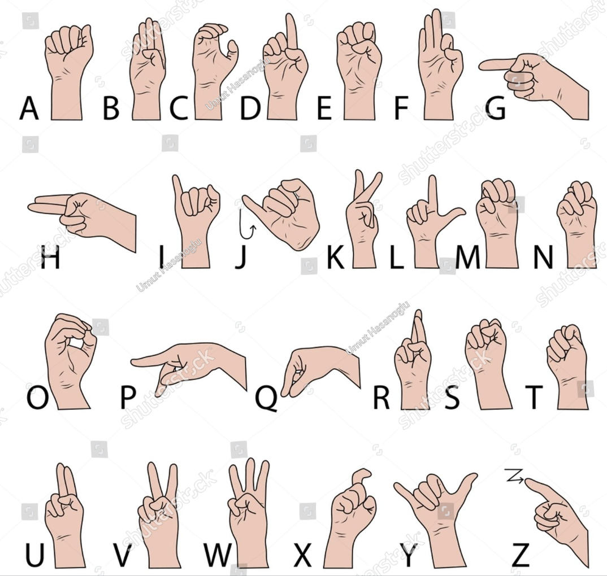

# Hand Detection & ASL Recognition

<p align="center">
  <a href="#english">English</a> ·
  <a href="#japanese">日本語</a>
</p>

---

<a name="english"></a>

## English

A real-time hand-tracking application built with **MediaPipe** and **OpenCV**, featuring:

- **3D Digital Twin** — perspective-rendered skin-mesh hand that mirrors your real hand in real time
- **ASL Finger-Spelling Recognition** — classifies all 26 American Sign Language letters (A–Z); J & Z detected via motion trajectory
- **Air Writing** — draw letters in the air with your index finger and recognize them with a CNN
- **ML Training Pipeline** — collect your own training data and train a custom SVM/MLP classifier

---

### Features

| Module | Description |
|--------|-------------|
| `main.py` | **Main program** — 3D hand twin + live ASL letter overlay |
| `air_writing.py` | Extension — air-writing canvas with gesture shortcuts |
| `classifier.py` | ASL classifier (geometric rules + optional ML model) |
| `collect_data.py` | Capture training samples for all 24 ASL letters |
| `collect_fist_data.py` | Capture training samples for fist-family letters (E/M/N/S/T) |
| `train_classifier.py` | Train a full 24-letter SVM or MLP classifier |
| `train_fist_classifier.py` | Train a fist-family SVM classifier |

---

### Requirements

- Python 3.9 – 3.11
- Webcam

```
opencv-python >= 4.8.0
mediapipe     >= 0.10.0
numpy         >= 1.24.0
tensorflow    >= 2.13.0
scikit-learn  >= 1.3.0
```

Install all dependencies:

```bash
pip install -r requirements.txt
```

---

### Quick Start

```bash
# Main program: 3D hand twin + ASL recognition
python main.py

# Extension: air-writing canvas
python air_writing.py
```

---

### Usage

#### `main.py` — 3D Hand Digital Twin  *(Main Program)*

Displays a perspective-rendered 3D hand that mirrors your real hand. The recognized ASL letter is shown at the bottom of the twin panel.

| Control | Action |
|---------|--------|
| Mouse drag | Rotate the 3D view |
| `R` | Reset rotation |
| `Q` / `ESC` | Quit |

**How it works**

- MediaPipe detects 21 hand landmarks per frame.
- Landmarks are centred at the wrist and normalized by the 3D wrist→MCP9 distance (rotation-stable scale).
- A perspective projection with a virtual focal length renders the skeleton as tapered skin capsules with Lambertian shading.
- Duplicate ghost detections are removed by comparing wrist positions; the higher-confidence detection is kept.
- ASL letter output is smoothed over a 15-frame sliding window (majority vote).

---

#### `air_writing.py` — Air Writing  *(Extension)*

Draw letters in the air with your index finger. Strokes are collected onto a canvas and recognized by a lightweight CNN.

| Gesture | Action |
|---------|--------|
| Index finger extended | Draw |
| Fist | Clear canvas |
| V sign (hold 0.8 s) | Insert space |
| Pinky only (hold 0.8 s) | Backspace |
| `Q` / `ESC` | Quit |

A cyan progress ring appears around the fingertip while holding the V sign; purple for backspace.

---

#### ASL Letter Reference

The classifier covers all **26 letters**. Static letters (A–Y excl. J) are classified per-frame; J and Z are detected via fingertip motion trajectory and displayed in **orange**.



```
A  B  C  D  E  F  G  H  I  J
K  L  M  N  O  P  Q  R  S  T
U  V  W  X  Y  Z
```

---

### ML Training Pipeline

The classifier uses a pre-trained model if one is present, otherwise falls back to geometric heuristics.

**Priority order:**
```
asl_classifier.pkl  (full 24-letter model)
    ↓ not found
fist_classifier.pkl (fist-family: E/M/N/S/T)
    ↓ not found
geometric heuristics (built-in rules)
```

#### Step 1 — Collect training data

```bash
# All 24 letters (target: 60 samples per letter)
python collect_data.py

# Resume an existing session
python collect_data.py

# Start over
python collect_data.py --fresh
```

| Key | Action |
|-----|--------|
| `SPACE` | Capture one sample |
| `BACKSPACE` | Undo last capture |
| `N` | Next letter |
| `P` | Previous letter |
| `A` | Toggle auto-capture (fires after 1 s of stillness) |
| `Q` / `ESC` | Save and quit |

> **Tip:** Vary the angle, distance, and orientation between captures to improve generalization.

#### Step 2 — Train the classifier

```bash
python train_classifier.py
```

The script tries both **SVM (RBF kernel)** and **MLP (128-64)**, selects the one with higher 5-fold cross-validation accuracy, and saves the bundle to `asl_classifier.pkl`.

Restart `main.py` or `air_writing.py` to load the new model automatically.

#### Optional — Fist-family only

If you only want to improve E/M/N/S/T without collecting all 24 letters:

```bash
python collect_fist_data.py   # target: 80 samples per letter
python train_fist_classifier.py
```

---

### File Structure

```
hand-detection/
├── main.py                  # Main program — 3D hand twin + ASL overlay
├── air_writing.py           # Extension — air-writing canvas
├── classifier.py            # ASL letter classification logic (incl. J/Z detector)
├── collect_data.py          # Data collection — all 24 letters
├── collect_fist_data.py     # Data collection — fist family
├── train_classifier.py      # Train full 24-letter model
├── train_fist_classifier.py # Train fist-family model
├── requirements.txt
├── asl_classifier.pkl       # Trained model (auto-loaded)
├── asl_data.npz             # Collected training data
├── fist_classifier.pkl      # Fist-family model
└── fist_data.npz            # Fist-family training data
```

---

### Technical Notes

- **Coordinate system:** MediaPipe normalises x ∈ [0,1] (left→right) and y ∈ [0,1] (top→bottom). The 3D twin flips y so that up is positive.
- **Scale normalisation:** All landmarks are divided by the 3D Euclidean wrist→MCP9 distance so the rendered hand stays the same size regardless of how far or at what angle the hand is held.
- **Ghost deduplication:** When MediaPipe re-detects the same physical hand twice (a known edge case), the duplicate is suppressed by comparing normalised wrist distances (threshold 0.10); the higher-confidence detection wins.
- **ASL model features:** 63-dimensional vector = 21 landmarks × (x, y, z), centred at wrist, normalised by wrist→MCP9 distance, then standardised with `StandardScaler`.

---

---

<a name="japanese"></a>

## 日本語

**MediaPipe** と **OpenCV** を使ったリアルタイム手部トラッキングアプリケーションです。

- **3D デジタルツイン** — 実際の手をミラーリングする透視投影スキンメッシュ
- **ASL 指文字認識** — 全 26 文字に対応（A–Z）；J・Z は動き軌跡で検出
- **空中描画 (Air Writing)** — 人差し指で空中に文字を描き、CNN でリアルタイム認識
- **ML トレーニングパイプライン** — 独自の訓練データを収集してカスタム SVM/MLP 分類器を学習

---

### 機能一覧

| モジュール | 説明 |
|-----------|------|
| `main.py` | **メインプログラム** — 3D 手部ツイン + リアルタイム ASL 文字オーバーレイ |
| `air_writing.py` | 拡張機能 — ジェスチャーショートカット付き空中描画キャンバス |
| `classifier.py` | ASL 分類器（幾何学ルール + オプション ML モデル） |
| `collect_data.py` | 24 文字全ての訓練サンプル収集 |
| `collect_fist_data.py` | 拳系文字（E/M/N/S/T）の訓練サンプル収集 |
| `train_classifier.py` | 24 文字 SVM または MLP 分類器の学習 |
| `train_fist_classifier.py` | 拳系 SVM 分類器の学習 |

---

### 動作環境

- Python 3.9 – 3.11
- ウェブカメラ

```
opencv-python >= 4.8.0
mediapipe     >= 0.10.0
numpy         >= 1.24.0
tensorflow    >= 2.13.0
scikit-learn  >= 1.3.0
```

依存関係の一括インストール：

```bash
pip install -r requirements.txt
```

---

### クイックスタート

```bash
# メインプログラム：3D 手部ツイン + ASL 認識
python main.py

# 拡張機能：空中描画キャンバス
python air_writing.py
```

---

### 使い方

#### `main.py` — 3D デジタルツイン  *（メインプログラム）*

実際の手をリアルタイムにミラーリングする透視投影 3D 手部を表示します。認識された ASL 文字はツインパネルの下部に表示されます。

| 操作 | 動作 |
|------|------|
| マウスドラッグ | 3D ビューを回転 |
| `R` | 回転をリセット |
| `Q` / `ESC` | 終了 |

**動作原理**

- MediaPipe がフレームごとに 21 個の手部ランドマークを検出します。
- ランドマークは手首を原点として中心化し、3D 手首→MCP9 距離で正規化（回転しても大きさが安定）。
- 仮想焦点距離を用いた透視投影でスケルトンをテーパー付きスキンカプセルとしてレンダリング、ランバート陰影付き。
- 手首位置の比較によるゴースト重複検出の除去（信頼度の高い方を保持）。
- ASL 文字出力は 15 フレームのスライディングウィンドウで平滑化（多数決）。

---

#### `air_writing.py` — 空中描画  *（拡張機能）*

人差し指で空中に文字を描きます。ストロークをキャンバスに蓄積し、軽量 CNN で認識します。

| ジェスチャー | 動作 |
|-------------|------|
| 人差し指を伸ばす | 描画 |
| 拳 | キャンバスをクリア |
| V サイン（0.8 秒ホールド） | スペース挿入 |
| 小指のみ（0.8 秒ホールド） | バックスペース |
| `Q` / `ESC` | 終了 |

V サインホールド中は指先にシアン色のプログレスリングが表示され、バックスペースは紫色です。

---

#### ASL 文字一覧

分類器は **全 26 文字**に対応しています。静的文字（A–Y、J を除く）はフレーム単位で分類し、J・Z は指先の動き軌跡で検出して**オレンジ色**で表示します。


```
A  B  C  D  E  F  G  H  I  J
K  L  M  N  O  P  Q  R  S  T
U  V  W  X  Y  Z
```

---

### ML トレーニングパイプライン

訓練済みモデルが存在する場合はそれを使用し、なければ幾何学ヒューリスティックにフォールバックします。

**優先順位：**
```
asl_classifier.pkl  （24 文字フルモデル）
    ↓ 未存在
fist_classifier.pkl （拳系：E/M/N/S/T）
    ↓ 未存在
幾何学ヒューリスティック（組み込みルール）
```

#### ステップ 1 — 訓練データ収集

```bash
# 24 文字すべて（目標：1 文字 60 サンプル）
python collect_data.py

# 既存セッションの再開
python collect_data.py

# 最初からやり直し
python collect_data.py --fresh
```

| キー | 動作 |
|------|------|
| `SPACE` | 1 サンプル収集 |
| `BACKSPACE` | 最後のサンプルを取り消し |
| `N` | 次の文字へ |
| `P` | 前の文字へ |
| `A` | 自動収集のトグル（1 秒間静止で自動取得） |
| `Q` / `ESC` | 保存して終了 |

> **ヒント：** 汎化性能向上のため、収集ごとに角度・距離・向きを変えてください。

#### ステップ 2 — 分類器の学習

```bash
python train_classifier.py
```

**SVM (RBF カーネル)** と **MLP (128-64)** の両方を試し、5 分割交差検証精度の高い方を選択して `asl_classifier.pkl` に保存します。

`main.py` や `air_writing.py` を再起動すると新しいモデルが自動読み込みされます。

#### オプション — 拳系文字のみ改善する場合

24 文字全て収集せずに E/M/N/S/T のみ改善したい場合：

```bash
python collect_fist_data.py   # 目標：1 文字 80 サンプル
python train_fist_classifier.py
```

---

### ファイル構成

```
hand-detection/
├── main.py                  # メインプログラム — 3D 手部ツイン + ASL オーバーレイ
├── air_writing.py           # 拡張機能 — 空中描画キャンバス
├── classifier.py            # ASL 文字分類ロジック（J/Z 動的検出含む）
├── collect_data.py          # データ収集 — 24 文字全て
├── collect_fist_data.py     # データ収集 — 拳系文字
├── train_classifier.py      # 24 文字フルモデルの学習
├── train_fist_classifier.py # 拳系モデルの学習
├── requirements.txt
├── asl_classifier.pkl       # 学習済みモデル（自動読み込み）
├── asl_data.npz             # 収集した訓練データ
├── fist_classifier.pkl      # 拳系モデル
└── fist_data.npz            # 拳系訓練データ
```

---

### 技術メモ

- **座標系：** MediaPipe は x ∈ [0,1]（左→右）、y ∈ [0,1]（上→下）に正規化。3D ツインでは y を反転して上方向を正とします。
- **スケール正規化：** 全ランドマークを手首→MCP9 間の 3D ユークリッド距離で除算することで、手の距離や角度に関係なくレンダリングサイズが安定します。
- **ゴースト重複除去：** MediaPipe が同じ手を 2 回検出するエッジケースに対し、正規化手首距離（閾値 0.10）を比較して重複を除去し、信頼度の高い方を残します。
- **ASL モデル特徴量：** 63 次元ベクトル（21 ランドマーク × (x, y, z)）を手首中心化 → 手首→MCP9 距離で正規化 → `StandardScaler` で標準化。
